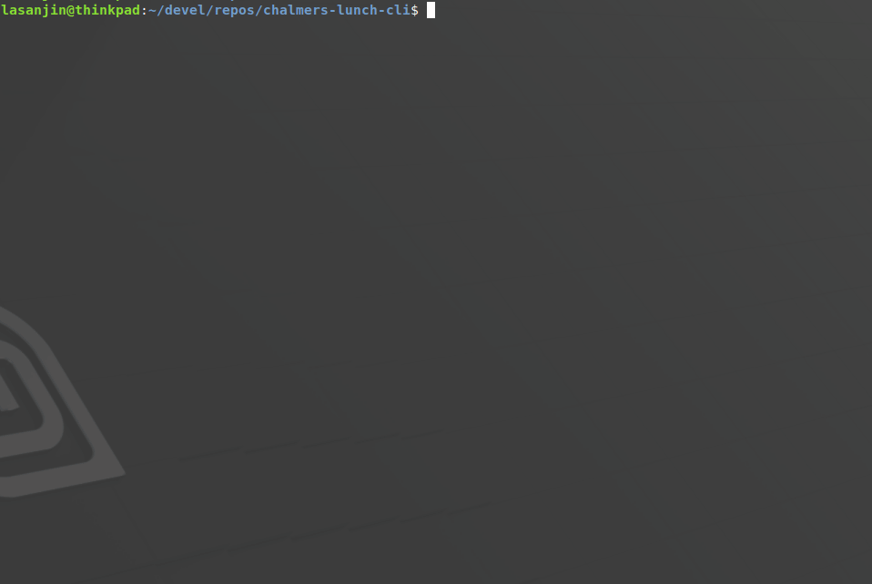

# Chalmers lunch CLI
Outputs Chalmers lunch menus.


## Description
Outputs Chalmers *Johanneberg*
- Expressen
- Kårrestaurangen
- Linsen
- S.M.A.K
- J.A. Pripps
  
lunch menu in terminal & highlights *Köttbullar* or *Meatballs*


## Demo



## Install
```
$ curl "https://raw.githubusercontent.com/lasanjin/chalmers-lunch-cli/master/install.sh" | bash
```


## How to run
```
$ clunch $1
```

- `$1`
  -  *optional* 
  -  number of days (default is today's menus)
  -  input `0-9`
