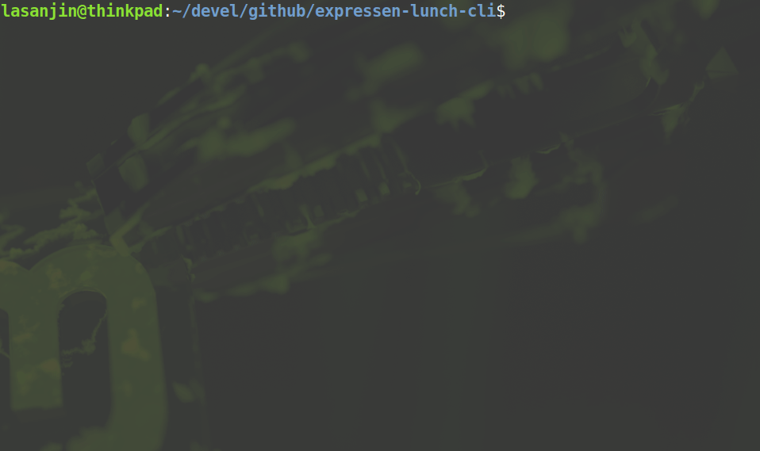

## Description
Outputs Chalmers expressen lunch in terminal & highlights "Meatballs" or "Köttbullar". 


<br/>


**OBS** Does NOT work for macOS ATM --> Try using optional installation instead until further notice.

## How to run
1. Make script executable
```
$ sudo chmod +x ./expressen.sh
```
2. Run script
```
$ ./expressen.sh $1 $2
```
- `$1`
  -  *optional* 
  -  #days from today
     -  input `0-9`, default is today's menu
- `$2` 
  - *optional*
  - language
    - input `s` for swedish menu, default is english

## Optional installation
1. Download jq library for Linux/macOS:
### macOS
```
$ brew install jq
```
### Linux
```
$ sudo apt-get install jq
```
1. Remove codeline 3-28 in [expressen.sh](expressen.sh) 
2. Replace `$jq` with `jq` in `get_expressen_data()` function